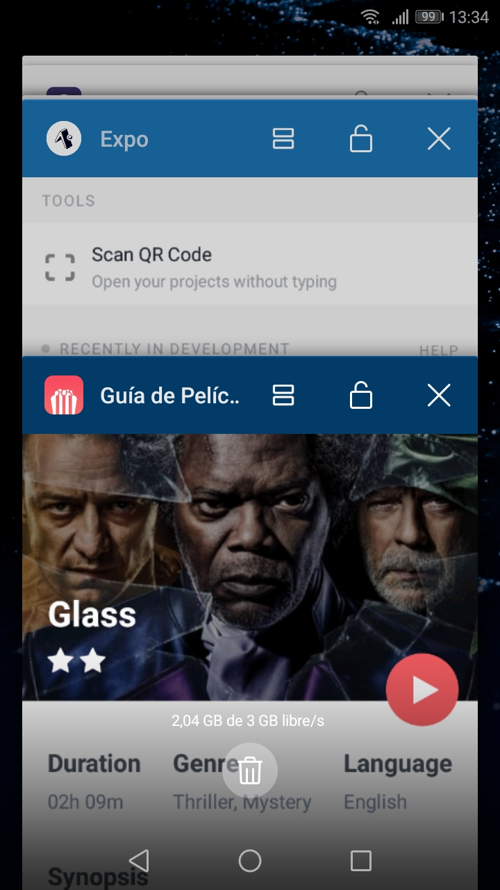

  
  <h3 align="center">Guía de Peliculones</h3>

---

App React Native con una guía de cine que consulta, cuando puede y quiere, la API de The Movie Database (TMDb).

## APIs

- [TMDb](https://developers.themoviedb.org/3/getting-started/introduction)

Atención: en esta app, todo puede fallar...

