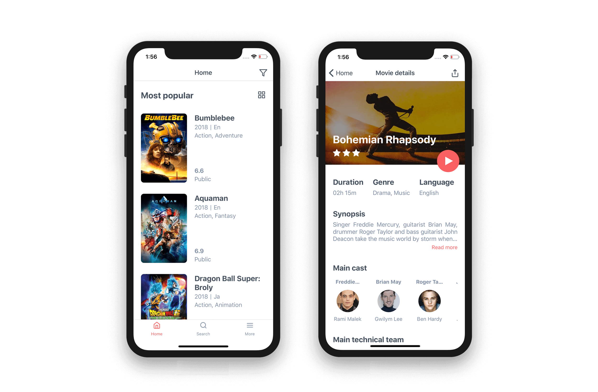

  
  <h3 align="center">Cine: The Movie Guide</h3>

---

App React Native con una guía de cine que consulta la API de The Movie Database (TMDb).

## APIs

- [TMDb](https://developers.themoviedb.org/3/getting-started/introduction)

